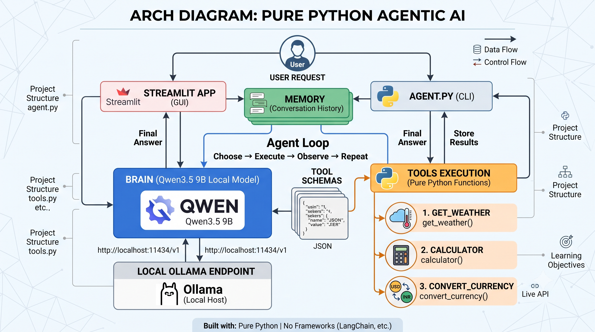

# AgenticGPT — Pure Python Agentic AI

A working AI agent built in **pure Python**, without LangChain, LangGraph, CrewAI, or AutoGen.

The goal of this project is to understand how an AI agent works internally before using agent frameworks. Everything an agent framework hides — the tool schemas, the message list, the loop that decides when to stop — is written out here in plain Python.

### 🔗 Live Demo

**[Try AgenticGPT →](https://akshatde-agenticailearning-pure-python-local-agentapp-qgqnq1.streamlit.app/)**

The hosted version runs on **Groq**, since a local model cannot run on Streamlit Cloud. Run it on your own machine to use **Ollama + Qwen** instead.

---

## What the Agent Does

- Understands a user request
- Decides whether a tool is required
- Selects and calls the correct Python function
- Reads the tool result
- Continues calling tools when needed
- Returns a final answer

---

## Arch Diagram



---

## Agent Workflow

```text
User Question
     ↓
LLM receives available tool schemas
     ↓
LLM selects a tool and generates its arguments
     ↓
Python executes the tool
     ↓
Tool result is added to conversation memory
     ↓
LLM returns an answer or calls another tool
```

The main agent cycle is:

```text
Choose → Execute → Observe → Repeat
```

The loop runs up to `max_turns` (default 10) and stops as soon as the model replies without requesting a tool.

---

## Two Model Backends

The same agent loop runs against either backend, and the Streamlit sidebar switches between them at runtime.

| Backend | Model | Where it runs | Speed |
|---|---|---|---|
| 🦙 **Ollama** | `qwen3.5:9b` | Your machine, fully offline | ~5–10s |
| ⚡ **Groq** | `openai/gpt-oss-120b` | Groq cloud API | under 1s |

Ollama keeps conversations and tool results entirely on your machine. Groq is there because a 9B model cannot be hosted on free infrastructure, which is what makes the live demo possible.

Both are plain `requests` calls — `ask_ai()` for Ollama and `ask_groq()` for Groq. No SDK involved.

---

## Available Tools

| Tool | Purpose |
|---|---|
| `get_weather` | Current weather for a city (WeatherAPI) |
| `calculator` | Evaluates an arithmetic expression |
| `convert_currency` | Live exchange rates (Frankfurter API) |

Tools are ordinary Python functions:

```python
def convert_currency(amount: float, from_currency: str, to_currency: str) -> str:
    response = requests.get(
        "https://api.frankfurter.dev/v1/latest",
        params={"base": from_currency.upper(), "symbols": to_currency.upper()},
        timeout=10,
    )
    rate = response.json()["rates"][to_currency.upper()]
    return str(round(amount * rate, 2))
```

Each function also has a JSON schema that tells the model its name, purpose, required arguments, and argument types. `TOOLS_BY_NAME` maps the name the model returns back to the real Python function.

---

## Project Structure

```text
pure-python-local-agent/
│
├── agent.py           # agent loop + both model backends
├── tools.py           # tool functions, schemas, registry
├── app.py             # AgenticGPT Streamlit interface
├── requirements.txt
└── README.md
```

### `agent.py`

`ask_ai()` calls Ollama, `ask_groq()` calls Groq, and `run_agent()` holds the loop: send messages, execute any requested tools, append results, repeat.

### `tools.py`

The tool functions, their JSON schemas, and the name → function registry.

### `app.py`

The Streamlit chat interface. Keeps history in `st.session_state`, captures the agent's printed trace, and shows it under each answer so you can see exactly which tools ran.

---

## Installation

```bash
git clone https://github.com/akshatDE/AgenticAILearning.git
cd AgenticAILearning/pure-python-local-agent
```

Install the dependencies:

```bash
pip install -r requirements.txt
```

### For the local backend (Ollama)

```bash
ollama pull qwen3.5:9b
```

```bash
ollama serve
```

### For the cloud backend (Groq)

Create a `.env` file in the project folder:

```text
GROQ_API_KEY=your_groq_api_key
```

`.env` is git-ignored, so the key stays on your machine. On Streamlit Cloud the same value goes in **Manage app → Settings → Secrets**.

---

## Run the Terminal Agent

```bash
python agent.py
```

---

## Run the Streamlit App

```bash
streamlit run app.py
```

Open the local URL shown in the terminal.

---

## Example Prompts

```text
What is the weather in Tokyo?
```

```text
Calculate (250 * 12) / 5.
```

```text
Convert 100 USD to INR.
```

```text
Convert 500 USD to INR and divide the result by 4.
```

The last example needs two tool calls, so it shows the loop running more than once.

---

## Core Components

1. **Brain** — Qwen3.5 9B locally, or GPT-OSS 120B on Groq
2. **Tools** — Python functions that perform actions
3. **Tool schemas** — descriptions of tools provided to the model
4. **Memory** — the conversation and tool results stored in a message list
5. **Agent loop** — repeatedly connects the model and tools until the task is complete

---

## Why This Is Agentic AI

A normal chatbot follows:

```text
User Question → Model Answer
```

This project follows:

```text
User Question
     ↓
Model selects an action
     ↓
Python executes the action
     ↓
Model observes the result
     ↓
Model decides the next step
     ↓
Final Answer
```

The model is not only generating text. It is deciding which actions should be performed to complete the task.

---

## One Thing Worth Knowing

Ollama and Groq do not speak quite the same dialect, and the loop has to handle both:

- Ollama returns tool arguments as a **dict**; Groq returns them as a **JSON string**, so they need parsing before the call.
- Ollama accepts a `tool_name` key on tool results; Groq rejects it and requires `tool_call_id` instead.

Small differences, but they are exactly the kind of thing a framework would paper over — and worth seeing once.

---

## Current Limitations

- `calculator` uses raw `eval()`, which is unsafe for untrusted input
- Conversation memory is not persistent — it resets when the app restarts
- Tool execution is synchronous
- Tool arguments are not validated beyond the schema
- No logging, retry handling, or token tracking
- Tool-calling quality depends on the model chosen

---

## Future Improvements

- Add Pydantic tool validation
- Replace `eval()` with a safe expression parser
- Move the WeatherAPI key into `.env` alongside the Groq key
- Add SQLite or PostgreSQL conversation memory
- Add logging and tool execution tracking
- Add file-reading and SQL tools
- Build a Data Engineering agent

---

## Learning Objective

This project exists to understand what agent frameworks do internally:

```text
Model + Tools + Memory + Agent Loop
```

The focus is not on building the most advanced agent. The focus is on learning the core mechanics using simple Python code.

---

## Author

**Akshat Sharma**

Learning and building projects in:

- Data Engineering
- Python
- Local LLMs
- Agentic AI
