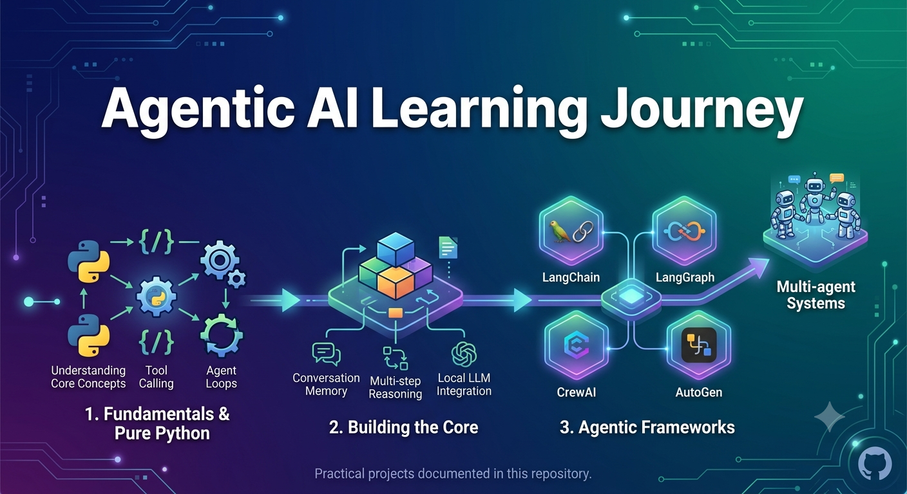

# Agentic AI Learning

This repository documents my journey of learning **Agentic AI** through practical projects.

The goal is to understand how AI agents work by starting with **pure Python implementations** and gradually moving toward modern agent frameworks such as:

- LangChain
- LangGraph
- CrewAI
- AutoGen

The projects in this repository focus on concepts such as:

- Tool calling
- Agent loops
- Conversation memory
- Multi-step reasoning
- Local LLM integration
- Multi-agent systems

The idea is to learn the fundamentals first, understand what happens behind the abstractions, and then use frameworks to build more advanced Agentic AI applications.

---

## Projects

### 1. [Pure Python Local Agent](pure-python-local-agent/) — *AgenticGPT*

A tool-calling AI agent written in plain Python, with no agent framework. It runs on a local model through Ollama, or on Groq in the cloud.

**[Live demo →](https://akshatde-agenticailearning-pure-python-local-agentapp-qgqnq1.streamlit.app/)**
